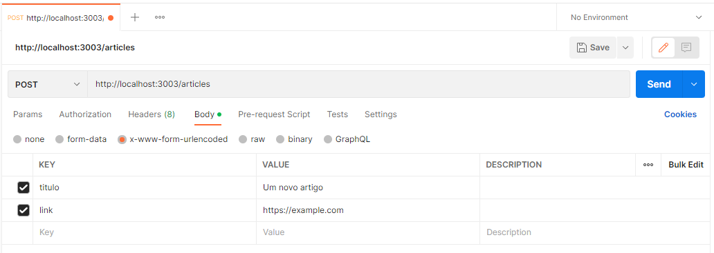

# Article List API

Este projeto é uma API desenvolvida em `Node.js` e `Express` e que pode ser acessado através do site [Article List API](https://article-list-api.herokuapp.com)

## Funcionalidades do projeto

É uma API que obtém, cria, deleta e altera artigos. Além disso, ele também possui um simples web crawler que acessa determinados sites e retorna uma lista dos seus artigos.

## Tecnologias e dependências

-   [Node.js v16.13.2](https://nodejs.org/en/)
-   [Express 4.18.1](https://expressjs.com/pt-br/)
-   [Body-parser 1.20.0](https://www.npmjs.com/package/body-parser)
-   [Cheerio 1.0.0-rc.12](https://cheerio.js.org)
-   [Cors 2.8.5](https://www.npmjs.com/package/cors)
-   [Got 11.8.3](https://www.npmjs.com/package/got)
-   [Uuid 9.0.0](https://www.npmjs.com/package/uuid)

## Funcionamento

É importante dizer que esta API salva os dados de maneira interna, através de um array no próprio código. Isso acontece porque o objetivo deste projeto é apenas de estudo e análise. Porém, o correto seria que tais dados fossem salvos em um banco de dados (com as devidas permissões para determinados usuários) para que eles ficassem persistentes, confiáveis e seguros.

## Instalação

Clone este repositório e após isso instale as dependencias do projeto utilizando o seguinte comando:

```sh
$ npm install
```

## Execução

Execute a aplicação com o comando `npm start`, ele irá iniciar o programa em [localhost:3003](http://localhost:3003)

```sh
$ npm start
```

## Endpoints da API

### Artigos

É possível adicionar, alterar e remover os artigos. Para realizar tais ações, basta acessar os métodos descritos abaixo

|  Método  |    Endpoint     | Descrição                                               |
| :------: | :-------------: | :------------------------------------------------------ |
|  `GET`   |   `/articles`   | Retorna todos os artigos salvos                         |
|  `GET`   | `/articles/:id` | Retorna apenas um artigo, de acordo com o id fornecido  |
|  `POST`  |   `/articles`   | Adiciona um artigo e retorna o ultimo artigo adicionado |
|  `PUT`   | `/articles/:id` | Altera um artigo e retorna o artigo alterado            |
| `DELETE` | `/articles/:id` | Deleta um artigo, de acordo com o id fornecido          |

#### Exemplos

<details>
  <summary>GET</summary>
  
  - Request
  
  ```
  localhost:3003/articles ou https://article-list-api.herokuapp.com/articles
  ```
  - Response
  ```
  [
    {
      "id":"d6e17e23-010b-4177-b519-7a87a5d1876f",
      "titulo":"O que são testes automatizados",
      "link":"https://devgo.com.br/o-que-sao-testes-automatizados",
      "data":"2022-09-18T21:52:55.108Z"
    }
  ]
  ```
</details>

<details>
  <summary>POST</summary>
  
  - Request
  
  Para realizar um POST, utilize um software como o [Postman](https://www.postman.com) e observe a imagem abaixo:



Atenção para o fato de que no Body o formato a ser usado é o `x-www-form-urlencoded` e de que os atributos `titulo` e `link` são obrigatórios.

O URL pode ser um dos dois:

```
localhost:3003/articles:id ou https://article-list-api.herokuapp.com/articles
```

-   Response

```
{
    "id": "0ed15894-59b5-4857-8730-287b522cebc7",
    "titulo": "Um novo artigo",
    "link": "https://example.com",
    "data": "2022-09-24T21:47:20.018Z"
}
```

</details>

<details>
  <summary>PUT</summary>
  
  - Request
  
  Para realizar um PUT, utilize um software como o [Postman](https://www.postman.com) e observe a imagem abaixo:


Atenção para o fato de que no Body o formato a ser usado é o `x-www-form-urlencoded`

O URL pode ser um dos dois:

```
localhost:3003/articles/:id ou https://article-list-api.herokuapp.com/articles/:id
```

Em que o `:id` é o id do artigo a ser modificado

-   Response

```
{
    "id": "0ed15894-59b5-4857-8730-287b522cebc7",
    "titulo": "Um novo artigo parte 2",
    "link": "https://example2.com",
    "data": "2022-09-24T21:47:20.018Z"
}
```

</details>

<details>
  <summary>DELETE</summary>
  
  - Request
  
  Para realizar um DELETE, utilize um software como o [Postman](https://www.postman.com) e observe a imagem abaixo:


O URL pode ser um dos dois:

```
localhost:3003/articles/:id ou https://article-list-api.herokuapp.com/articles/:id
```

Em que o `:id` é o id do artigo a ser deletado

-   Response

```
The article was sucessfully deleted
```

</details>

## Web Crawlers

É possível obter uma lista dos sites em que existe um web crawler implementado e também uma lista dos artigos que cada site possui. Para realizar tais ações, basta acessar os métodos descritos abaixo

| Método |       Endpoint       | Descrição                                                        |
| :----: | :------------------: | :--------------------------------------------------------------- |
| `GET`  |    `/webcrawlers`    | Retorna os nomes dos sites em que é possível realizar webcrawler |
| `GET`  | `/webcrawlers/:site` | Retorna uma lista dos artigos do site fornecido                  |

Em que `:site` é o site que deseja realizar um web crawler e obter os seus artigos. Atualmente, apenas o site `DevGo` está implementado.

#### Exemplos

<details>
  <summary>GET /webcrawlers</summary>
  
  - Request
  
  ```
  localhost:3003/webcrawlers ou https://article-list-api.herokuapp.com/webcrawlers
  ```
  - Response
  ```
  [
      {
          "nome": "DevGo"
      }
  ]
  ```
</details>

<details>
  <summary>GET /webcrawlers/devgo</summary>
  
  - Request
  
  ```
  localhost:3003/webcrawlers/devgo ou https://article-list-api.herokuapp.com/webcrawlers/devgo
  ```
  - Response
  ```
  [
      {
          "titulo": "O que são testes automatizados",
          "link": "https://devgo.com.br/o-que-sao-testes-automatizados"
      },
      {
          "titulo": "Como fazemos o Gitflow",
          "link": "https://devgo.com.br/como-fazemos-o-gitflow"
      },
      {
          "titulo": "O que é Atomic Design",
          "link": "https://devgo.com.br/o-que-e-atomic-design"
      },
      .
      .
      .
  ]
  ```
</details>
